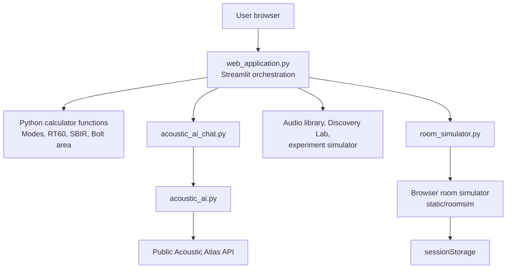

# Acoustic Design Assistant Architecture

## Purpose and Scope

Acoustic Design Assistant (ADA) is a Streamlit application for exploring small-room acoustics. It combines calculation tools, interactive visualizations, educational content, an external acoustics chat service, and a client-side room simulator.

This document describes the current codebase as it is intended to run today:

- Streamlit is the application runtime and hosting target.
- Firebase is not an active application dependency.
- The embedded room simulator runs entirely in the browser.
- The only runtime network integration is the public Acoustic Atlas AI endpoint.

## Runtime Entry Points

| Use case | Command or file | Notes |
| --- | --- | --- |
| Local application | `./.venv/bin/streamlit run web_application.py` | Starts the Streamlit UI on the default port, normally 8501. |
| Alternate local port | `./.venv/bin/python -m streamlit run web_application.py --server.port 8502` | Useful when port 8501 is in use. |
| Unit tests | `./.venv/bin/python -m unittest discover -s . -p 'test_*.py' -v` | Runs the repository's Python unit tests. |
| Container runtime | `Dockerfile` | Optional Cloud Run-oriented deployment path; it launches Streamlit. |

`web_application.py` is the application composition root. It is the only file Streamlit needs to execute directly.

## System Map



There are two independent state domains:

1. Streamlit state: page/tool selection, shared room dimensions, and chat history.
2. Browser simulator state: room polygon, materials, source positions, listener position, and selected view. It is stored in the iframe's `sessionStorage`.

The browser simulator receives initial dimensions from Streamlit, but its edits do not flow back into Streamlit's sliders.

## Repository Layout

| Path | Responsibility |
| --- | --- |
| `web_application.py` | Main Streamlit UI, shared room inputs, Plotly charts, navigation, and page composition. |
| `acoustic_calculations.py` | Pure room-ratio, Bolt-area, axial-mode, and SBIR calculations shared by the Streamlit app and unit tests. |
| `acoustic_ai.py` | Validated HTTP client and prompt construction for the public Acoustic Atlas endpoint. |
| `acoustic_ai_chat.py` | Streamlit chat interface, conversation state, streaming display, suggestions, and error presentation. |
| `audio_library.py` | Audio-guide catalog, filtering, and embedded carousel markup. |
| `digital_lab.py` | Historical acoustics experiment catalog and interactive embedded lab browser. |
| `experiment_simulator.py` | Configuration and generated HTML/JavaScript for ten educational experiments. |
| `room_simulator.py` | Streamlit wrapper that reads, bundles, and embeds `static/roomsim` assets. |
| `static/roomsim/` | Dependency-free browser room editor and simulator. |
| `test_*.py` | Python unit tests for the API client and content modules. |
| `requirements.txt` | Python runtime dependencies. |
| `Dockerfile` | Optional container image definition for Streamlit. |
| `firebase.json` | Legacy Firebase Hosting rewrite configuration; not required for Streamlit hosting. |
| `public/index.html` | Default Firebase Hosting placeholder page; not part of the Streamlit container runtime. |
| `skills-lock.json` | Coding-agent skill metadata; not application code or runtime configuration. |

## Main Streamlit Application

### Shared Inputs and Navigation

`web_application.py` collects room length, width, and height once and reuses them across the calculators. It also owns the navigation and Streamlit session/query-parameter coordination.

The page composes these major experiences:

- Modal analysis and Bolt-area visualization.
- RT60 calculation with material selections.
- SBIR analysis for speaker-boundary distances.
- Advanced browser room simulator.
- Acoustic Atlas chat.
- Audio guides, the historical Discovery Lab, and interactive experiments.
- Static learning resources.

### Python-Side Acoustic Calculations

`acoustic_calculations.py` contains the pure Python calculation functions; `web_application.py` supplies their Streamlit inputs and visualizes their outputs. The material coefficients remain in the main application file.

| Function or data | Role |
| --- | --- |
| `MATERIALS` | Absorption coefficients by material and octave band. |
| `OCTAVE_BANDS` | The modeled bands: 125 Hz through 4 kHz. |
| `get_room_ratios(L, W, H)` | Produces normalized dimension ratios for the Bolt-area check. |
| `check_bolt_area(x, y)` | Applies the app's simplified stable-zone bounds. |
| `calculate_modes(L, W, H, max_freq)` | Produces axial modal frequencies for the visualizations. |
| `calculate_sbir_curve(distances)` | Produces an illustrative cancellation-response curve. |

The main formulas are:

$$
f_{n,axis} = \frac{c}{2}\frac{n}{d}
$$

for an axial room mode, where $c = 343$ m/s and $d$ is one room dimension.

$$
RT60_{Sabine} = \frac{0.161V}{A}
$$

$$
RT60_{Eyring} = \frac{0.161V}{-S\ln(1-\bar{\alpha})}
$$

$$
f_{SBIR} = \frac{c}{4d}
$$

The app intentionally uses teaching-oriented approximations. It models axial modes rather than tangential and oblique modes, uses a simplified Bolt-area rectangle rather than a detailed polygon, and uses a stylized SBIR notch rather than a full boundary-interference simulation.

## Acoustic Atlas Chat

### `acoustic_ai.py`

This module is a reusable, UI-independent client for the public Acoustic Atlas service.

- Validates question length and minimum word count before making a request.
- Builds a bounded conversation window so prompts do not grow without limit.
- Adds the current room context to the acoustics system prompt.
- Sends regular or streaming HTTP requests.
- Uses `certifi` certificates and a custom user-agent for reliable TLS requests.
- Converts common remote errors into application-friendly messages.

It does not use Firebase AI Logic, Firestore, Authentication, Cloud Functions, or any Firebase SDK.

### `acoustic_ai_chat.py`

This module renders the chat experience inside Streamlit. It stores messages, suggestions, and errors in `st.session_state`. For streamed replies, it consumes the response in a daemon thread and reveals the buffered text progressively in the UI.

The chat service is external and stateless from ADA's perspective. No chat history is stored in a database; it exists only for the active Streamlit session.

## Educational Content Modules

### `audio_library.py`

Defines six audio-guide records, organized around modal analysis, RT60, and SBIR. The module filters guides by topic and renders a self-contained carousel through Streamlit components.

### `digital_lab.py`

Defines seven historical acoustics records, including Helmholtz, Sabine, Pohl, Fletcher, Haas, Franssen, and Schroeder. It generates embedded HTML and JavaScript that lets users browse records and inspect schematic illustrations.

### `experiment_simulator.py`

Defines ten small interactive simulations. Configuration data describes each simulation's controls, such as numeric ranges, selections, toggles, and actions. The module emits an embedded interactive canvas experience rather than exposing a Python API for each experiment.

## Browser Room Simulator

### Embedding Boundary

`room_simulator.py` bridges Python and the browser simulator.

1. It reads the HTML, CSS, and JavaScript assets in `static/roomsim/`.
2. It caches the asset bundle for the Streamlit process.
3. It injects the current room dimensions into `window.__ADA_SEED__`.
4. It displays the complete application using `streamlit.components.html`.

The seed is one-way. Adjusting the Streamlit room dimensions changes the simulator's starting box room, but dragging objects or editing walls in the simulator does not update the Streamlit widgets.

### Frontend Modules

| Path | Responsibility |
| --- | --- |
| `static/roomsim/index.html` | Page shell, controls, canvases, chart containers, and script load order. |
| `static/roomsim/css/style.css` | Responsive layout, theme, controls, and fullscreen styling. |
| `static/roomsim/js/engine.js` | Pure geometry and acoustics calculations; no DOM ownership. |
| `static/roomsim/js/charts.js` | Native SVG chart builders for RT60, SPL, and modes. |
| `static/roomsim/js/editor.js` | Two-dimensional canvas editor for polygons, walls, sources, and listener placement. |
| `static/roomsim/js/view3d.js` | Dependency-free perspective room renderer with orbit controls. |
| `static/roomsim/js/app.js` | Global state, events, persistence, calculation scheduling, and UI rendering. |

### Browser State and Update Loop

The browser application owns a state object shaped like this:

```javascript
{
  room: { H, points },
  surfaces: { floor, ceiling, walls },
  sources: [{ x, y, z, Lw, Q }],
  listener: { x, y, z }
}
```

When a user changes a control or drags an object:

1. `editor.js` or `view3d.js` updates state through an `app.js` callback.
2. `app.js` batches work through `requestAnimationFrame`.
3. `engine.js` recalculates absorption, RT60, modes, SPL, heatmap data, and derived values.
4. `app.js` updates panels, charts, and the active canvas.
5. The resulting browser state is written to `sessionStorage`.

The simulator supports rectangular rooms and custom simple-polygon floor plans. Detailed modal and Bolt-area reporting applies only when the room remains rectangular.

### Frontend Acoustic Model

`engine.js` expands on the main calculator with room-wide geometry and a steady-state SPL estimate:

$$
L_p = L_w + 10\log_{10}\left(\frac{Q}{4\pi r^2} + \frac{4}{R}\right)
$$

where $L_w$ is source power level, $Q$ is directivity, $r$ is listener distance, and $R$ is the room constant. Multiple sources are energy-summed.

It also computes an illustrative SPL heatmap, target RT60, room constant, critical distance, Schroeder frequency, and SBIR notches. These are fast visual-design tools, not a calibrated measurement or wave-equation solver.

## Data Ownership and Persistence

| Data | Owner | Persistence |
| --- | --- | --- |
| Streamlit controls and tool selection | `web_application.py` | Current Streamlit session and query parameters. |
| Chat conversation | `acoustic_ai_chat.py` | Current Streamlit session only. |
| Audio/lab/experiment catalog data | Corresponding Python module | Source-controlled Python constants. |
| Browser room design | `static/roomsim/js/app.js` | Browser `sessionStorage`; no server persistence. |
| Room-simulator seed | `room_simulator.py` | Derived from current Streamlit dimensions. |

There is currently no user account system, database, file upload workflow, room-project save file, or shared collaboration state.

## Deployment and Firebase Boundary

### Active Streamlit Deployment Surface

For a Streamlit deployment, the required application artifacts are:

- `web_application.py` and its local Python imports.
- `requirements.txt`.
- `static/roomsim/`.

`requirements.txt` contains the runtime packages: `certifi`, `streamlit`, `numpy`, `pandas`, and `plotly`.

The optional `Dockerfile` packages those artifacts into a Python 3.11 image and starts Streamlit on `$PORT`. It is suitable for a container host such as Cloud Run, but it is not required by Streamlit Cloud.

### Inactive Firebase Artifacts

Firebase is not used by the active Python app or the browser room simulator.

- `firebase.json` describes a Firebase Hosting rewrite to a Cloud Run service named `ada-streamlit`.
- `public/index.html` is the default Firebase Hosting setup page and includes Firebase SDK scripts.
- The Docker image does not copy `public/`, so that Firebase page is not part of the containerized Streamlit app.
- No source file imports a Firebase Python SDK, browser Firebase SDK, Firestore client, Authentication client, Cloud Function, or Firebase AI client.

Treat `firebase.json` and `public/index.html` as legacy deployment scaffolding. They can remain harmlessly in the repository, but should not be extended or relied on while the project is hosted through Streamlit.

## Testing Status

The repository currently uses the standard-library `unittest` framework.

| Test file | Scope |
| --- | --- |
| `test_acoustic_calculations.py` | Room ratios, Bolt-area boundaries, axial modes, SBIR behavior, invalid dimensions, and a combined room-analysis workflow. |
| `test_acoustic_ai.py` | Validation, conversation trimming, system prompts, mocked API responses, streaming, and rate-limit handling. |
| `test_audio_library.py` | Catalog completeness and topic filtering. |
| `test_digital_lab.py` | Historical-record data and generated markup. |
| `test_experiment_simulator.py` | Experiment data, supported control types, and generated markup. |

The current suite contains 27 unit tests.

Important test gaps:

- The room simulator's JavaScript engine and interactions have no automated tests.
- There are no Streamlit browser/integration tests.
- The chat tests mock the remote service, so they do not prove live Acoustic Atlas availability.

## Maintenance Guidance

### Where to Change a Feature

| Desired change | Primary location |
| --- | --- |
| New Streamlit calculator or page section | `web_application.py` |
| Core room-acoustics calculation | `acoustic_calculations.py` plus `test_acoustic_calculations.py` |
| New AI validation, prompt, or HTTP behavior | `acoustic_ai.py` |
| Chat layout or rendering behavior | `acoustic_ai_chat.py` |
| New guide or historical record | The corresponding catalog module |
| New experiment configuration | `experiment_simulator.py` |
| Browser-room acoustic behavior | `static/roomsim/js/engine.js` |
| Browser-room controls and state | `static/roomsim/js/app.js` |
| 2D or 3D editing interactions | `editor.js` or `view3d.js` |
| Browser-room visual styling | `static/roomsim/css/style.css` |

### Important Consistency Rule

Room-acoustics logic and material coefficients exist in both the Python main application and the browser simulator. When a material, formula, octave band, or modeling assumption must match across both tools, update and test both implementations:

- Python: `acoustic_calculations.py` (and the material data in `web_application.py` when relevant)
- Browser: `static/roomsim/js/engine.js`

Without that coordinated change, the main calculators and advanced simulator can produce different results for the same room.

### Current Limitations to Preserve in Product Decisions

- RT60 formulas assume an approximately diffuse field and are least reliable at low frequencies.
- Modal reporting is axial only.
- SBIR is illustrative rather than a full multipath acoustic prediction.
- The browser simulator uses a flat-spectrum, steady-state point-source model.
- Browser room edits are local to one browser session and are not exportable or shareable.
- The external AI service is a dependency outside this repository's control.

## Recommended Change Checklist

Before changing the application, identify the owning layer:

1. Streamlit UI and shared input: `web_application.py`.
2. Reusable Python logic: a focused Python module plus a `test_*.py` file.
3. Browser-only simulation behavior: `static/roomsim/js/`.
4. Deployment-only behavior: `requirements.txt` or `Dockerfile`.
5. Firebase: do not add it unless there is an explicit decision to resume Firebase deployment or services.

After a change, run:

```bash
./.venv/bin/python -m unittest discover -s . -p 'test_*.py' -v
```

Then start Streamlit and manually verify the affected interaction, especially when changing embedded browser assets or Streamlit session behavior.